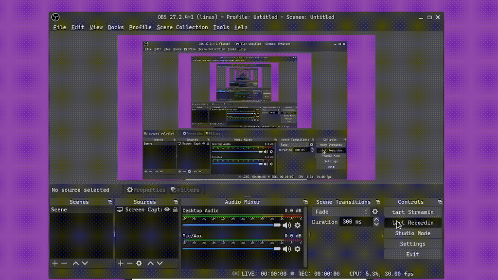

# Go Expense Tracker

## Powered by

* GoLang
* GoTemplate
* OpenIDConnect (like Keycloak or Google)
* MongoDB
* Bootstrap
* Based on [goAPIBaseProject](https://github.com/mhkarimi1383/goAPIBaseProject)

## How to bring it up?

since I'm using onedev in my lab you can see that [.onedev-buildspec.yml](.onedev-buildspec.yml) contains configuration needed to build and deploy the project

or

set required variables and run golang project directly

## Demo

